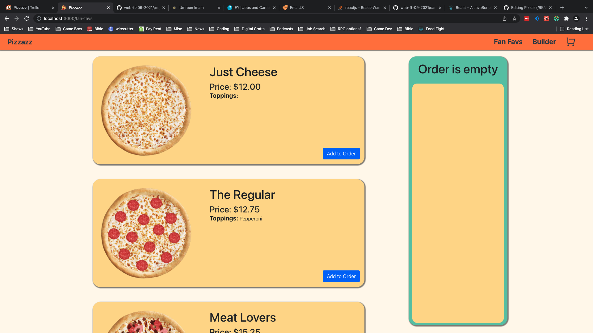
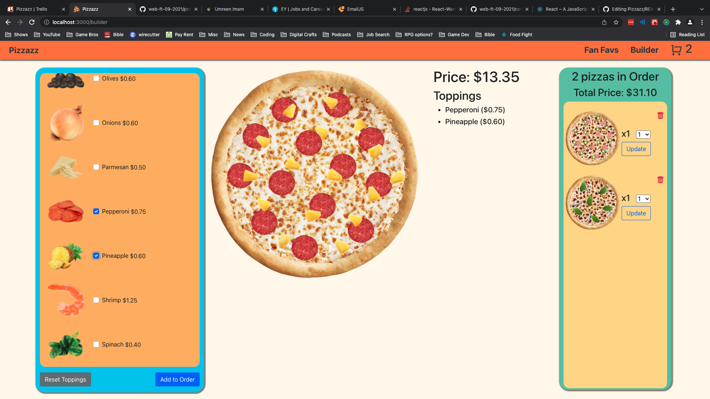

# Pizzazz - Pizza Builder

## Overview:
Pizzazz is a pizza building site where a user is able to customize pizzas with a variety of different toppings. A user can also look through some pre-built fan favorite pizzas.  

## Application screenshots:

 

 

 

## Team:

Stephen Doty
 

## Tools used to build this application:

HTML,
CSS,
Bootstrap,
JavaScript,
React,
Redux

## Basic Objectives:

Allow individuals to build their own pizza with a variety of toppings or choose from a selection of fan favorites.
 - User can add their pizzas or fan favorites to their order. 
 - Change quantity of pizzas on the order.
 - Focus on fucntionality and implment a nice webpage layout.

## Flex Goals Completed:

- Visually show pizza being built
- Track price of pizza as toppings are added
- Add multiple pizzas to order
- Show order items on builder page as they are added with delete and quantity buttons
- Show order items on cart page with delete and quantity buttons along with subtotal, tax, and total
- Fan favorites page with pre-built pizzas

## Stretch Goals Future:

- Add customer built pizzas to favorites
- Sort toppings in specific order (meats, seafood, veggies, misc...)
- Add deals that a user can use on an order
- Select lite, regular, or extra toppings
- Different types of crust
- Different types of cheese
- Different size pizzas (X-Large, Large, Medium)
- Coupon codes
- Drag & drop toppings
- Be able to edit pizza in the cart
- Make it a game where you build pizzas for orders comming in. Keep track of profits. Have cost vs price. When orders are late, customer is charged less. Quick orders customer is charged more. 

## Challenges & Solutions:

Challenges: 
- Tracking global state through out the application
- Stacking toppings one on top of the other
- Implementing quantity options for orders in cart
 

Solutions:
- Referenced previous projects to review structure of data flow
- Made use of Photoshop to create PNGs of toppings along with position absolute to stack toppings
- Referenced previous projects for logic of quantity

