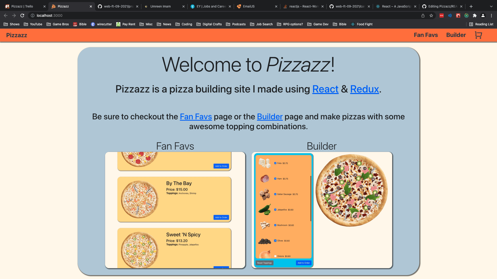

# Pizzazz - Pizza Builder

## Overview:
Pizzazz is a pizza building site where a user is able to customize pizzas with a variety of different toppings. A user can also look through some pre-built fan favorite pizzas.  

## Application screenshots:


<br/>


<br/>


<br/>


<br/>


<br/>


<br/>


<br/>


<br/>

## Team:

Mercer Mahaffey
<br>
Devin Brock
<br>
Stephen Doty
<br>
James Ivy
<br>

## Tools used to build this application:
[Themeforest](https://themeforest.net/item/sociala-social-network-app-html-template/31502548) was used as a starter template to focus more on the functionality aspects of the website for this project.

HTML,
CSS,
JavaScript, 
SQL,
bcryptjs,
cloudinary,
cookie-session,
dotenv,
ejs,
formidable,
passport,
pg,
sequelize,

## Basic Objectives:

Allow individuals to create an account to connect with other developers to discuss their coding journey.
 - Upload photos and make posts about their coding journey. 
 - Provided free resources to each user to assist with their coding journey
 - Focus on fucntionality and implment a nice webpage layout.

## Flex Goals Completed:

- Authentication
- Functionality for register page
- Create and Delete posts
- Upload a photo
- Display date and time of each posts 
- Allow another user to comment on a antoher users post
## Stretch Goals Future:

- Ability to upload videos
- Ability to edit posts and comments
- Ability to follow or add another user as a friend
- Chatroom functionality
- Sending messages to specific users
- Ability to track a users coding journey via Graph

## Challenges & Solutions:

Challenges: 
- Implementation of cloudinary
```
// creating new post
router.post("/posts", async (req, res, next) => {

    // creating post with form/cloudinary
    let userid = req.session.passport.user;
    
    // using formidable to grab encrypted data from the form
    const form = new formidable.IncomingForm();
    
    // gives filepath to house temp image file
    let uploadFolder = path.join(__dirname, "../public", "files")
    form.uploadDir = uploadFolder
    form.parse(req, async (err, fields, files) => {
        if(err){
            console.log(`An error has occurred inside of form.parse(): ${err}`);
            next()
            return
        }
        // upload image to cloudinary and create post entry in db
        if(files.upload.size !== 0){
            await cloudinary.uploader.upload(files.upload.filepath, async (err, result) => {
                if(err){
                    console.log(`An error has occurred inside of cloudinary: ${err}`);
                    return
                }
                let languages = '';
                if(fields.javascript){
                    languages += "javascript, "
                }
                if(fields.html){
                    languages += "html, "
                }
                if(fields.css){
                    languages += "css, "
                }
                if(languages == ''){
                    languages = ''
                }
                languages = languages.substring(0, languages.length-2)
                await db.posts.create({title: fields.title, content: fields.content, languages, userid: userid, imgurl: result.secure_url})
                res.redirect("/")
            })
            // deletes temp image file in files folder
            fs.unlinkSync(files.upload.filepath)
        }
        else if(fields.content !== ""){
            let languages = '';
            if(fields.javascript){
                languages += "javascript, "
            }
            if(fields.html){
                languages += "html, "
            }
            if(fields.css){
                languages += "css, "
            }
            if(languages == ''){
                languages = ''
            }
            languages = languages.substring(0, languages.length-2)
            await db.posts.create({title: fields.title, content: fields.content, languages: languages, userid: userid, imgurl: ""})
            fs.unlinkSync(files.upload.filepath)
            res.redirect("/")
        }
        else{
            fs.unlinkSync(files.upload.filepath)
            res.redirect("/")
        }
    })
})
```
- Working from someone else's HTML/CSS/SCSS template and making it your own
- Figuring out functionality of code for multiple users
<br>

Solutions:
- Reading through documentation and reaching out to outside resources
- Took the time to filter through their code and made it our own.
- Taking the time to refactoring the logic for the functionality

